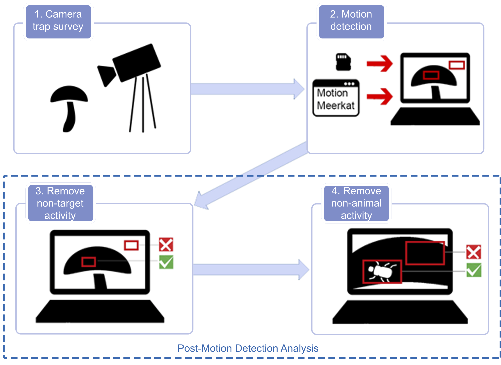

# The ppMMr package
Post-processing of MotionMeerkat output in R

```r
install.packages("devtools")
devtools::install_github("FranzKrah/ppMMr")
library(ppMMR)
```
Here we will only display the overview of the workflow. For a more detailled analysis workflow consult the vignette.

## The motion-detection pipeline

### Step 1 and 2: pre motion-detection analysis
These steps are done before using the ppMMr package, thus before the post motion-detection pipeline. 

### Step 3 and 4: post motion-detection analysis
```
> path <- "LOCAL\PATH\TO\PROJECT"
> remove_non_target(path) # remove user-defined non-target putative movement
> remove_non_animal(path, batch = 1000) # remove false-positive animal movement on target
> add.time(path) # add day time
> mot_tab <- read_motion_table(path) # read motion table, which can now be used for analysis
> head(mo_tab)
```
