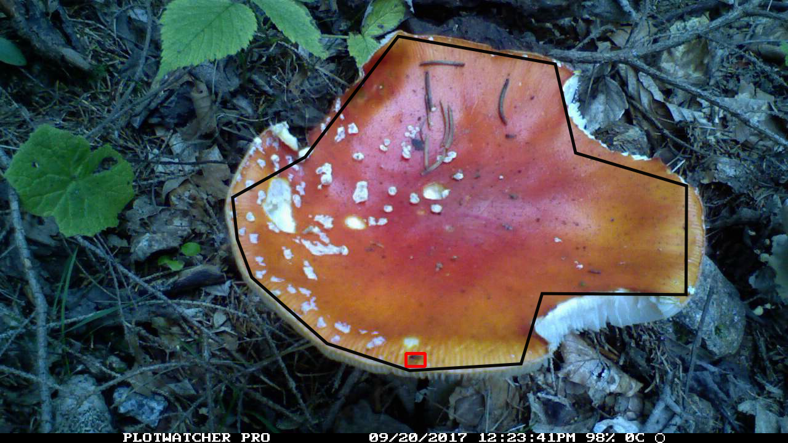
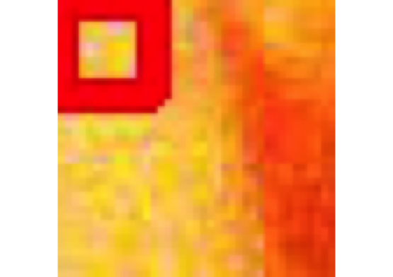
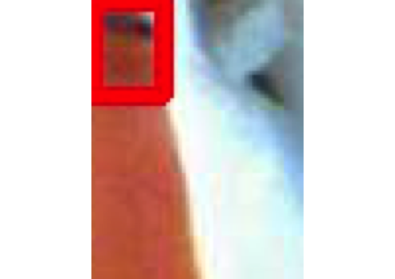

# The motion detection pipeline 
First, we conduct a camera survey in the field (here a mushroom survey). Campera survey cameras yield stacked image files. In the case of PlotWatcher cameras, the cameras produce TLV files, split by days. These TLVs are secondly subjected to a motion detection software, e.g., MotionMeerkat (hereafter, MM)(Weinstein 2015). This step reduces the frame space to frames with putative (animal) movement.\\
Based on the MotionMeerkat results, we will further process the data using the post motion-detection pipeline described in (Fig. 1, Schmid et al. unpublished). This is usually done manually, however, if you still have a large amount of frames left after MM you probably want to do this at least semi-automated. Note that for large animals (e.g. mammals) there are other semi-automated methods available (e.g. AnimalFinder). \\
In the third and fourth step you will want to remove non-target specific movement. In our case movement which was not on the mushroom. In a final step you want to remove false-positives, thus putative animal movement which is in fact non-animal movement (wind-induced leave movement, raindrops, falling leaves - especially anoying in the mushroom season). 


### Post-processing of MotionMeerkat output in R (ppMMr)
## Install and load R package ppMMr

```{r load, include=TRUE, eval = TRUE, echo=FALSE}
library(devtools)
install_github("FranzKrah/ppMMr")
library(ppMMr)
```

## Post-motion detection folder structure

ppMMr works on a supplied folder path. It then operates on the TLV-based folder which result from the MM analysis. Keep the TLV files in the directories, because they are needed as source for meta-data.

```{r, echo=TRUE}
path <- getwd()
path <- paste0(path, "/post_MM_proj") # select the post MM project
```

```{r, echo=TRUE}
dir <- list.files(path) # 1 species, 2 individuals
subdir1 <- list.files(paste0(path, "/A_muscaria1")) # 2 days (2017-09-19 and 2017-09-20)
subdir2 <- list.files(paste0(path, "/A_muscaria2")) # 2 days (2017-09-19 and 2017-09-20)
list(post_MM_proj = dir, A_muscaria1 = subdir1, A_muscaria2 = subdir2)
```


## Step 3 Remove non-target animals
In this step we will user-define the target area in the first frames. Each MM output folder comes with a frames.csv. After the target area was defined the pipeline goes through all putative motion hits and adds a column frames.csv files. This column is called "target" and of class logical (0/1). \\

```{r, eval = FALSE}
remove_non_target(path, n = 10) # This is unfortunatelly not working in knitr since the user must add points in the image. Thus I will include a sample image here.
```



In this case we have 2 individuals of Amanita muscaria (fly agaric) with each two days of camera survey. The function call would have looked like this:

```{r, eval = FALSE}
 > Please click  10  times in the image (do not click more!) 
1 Frames now updated 
 > Please click  10  times in the image (do not click more!) 
2 Frames now updated 
 > Please click  10  times in the image (do not click more!) 
3 Frames now updated 
 > Please click  10  times in the image (do not click more!) 
4 Frames now updated 
Motion table written to  Documents/PhD/proj/high_priority/plot_watcher_mushroom/ppMMr_test/post_MM_proj/
```

The project (path) folder was now updated by a combined frames.csv file and now all operations will be performed based on this file.\\
It can be read into R with:
```{r table}
mo_tab <- read_motion_table(path)
head(mo_tab)
```


## Step 4 Remove non-animal motion hits
In this step all remaining hits will be plotted into the console. The plot will show a zoomed version of the hit frame. MM stored the top left and bottom right coordinates of a frame that was placed around the putative animal hit. Here we plot this frame with a bit of extra space around.

```{r nonanimal, eval=FALSE}
remove_non_animal(path, batch = 10) # Again not working in markup.
# batch = 10: after 10 hits the output is stored to the motion table.
# Then the function asks the user to run the next batch or to stop.
# If stopped, the function will resume with the next batch where the user stoppend.
# Larger datasets take time. It took us roughly 20 minutes to click 1000 hits.
```

Here an example frame with zoomed hit area:

```{r examplenonanimal, eval=FALSE}
> 1  Animal? (no = 0/ yes = 1/ unclear = 2); Consider top left red square!
> 0
```

 

```{r examplenonanimal2, eval=FALSE}
> 2  Animal? (no = 0/ yes = 1/ unclear = 2); Consider top left red square!
> 0
```




```{r examplenonanimal3, eval=FALSE}
> 3  Animal? (no = 0/ yes = 1/ unclear = 2); Consider top left red square!
> 0
> 4  Animal? (no = 0/ yes = 1/ unclear = 2); Consider top left red square!
> 0
> 5  Animal? (no = 0/ yes = 1/ unclear = 2); Consider top left red square!
> 0
> 6  Animal? (no = 0/ yes = 1/ unclear = 2); Consider top left red square!
> 0
> 7  Animal? (no = 0/ yes = 1/ unclear = 2); Consider top left red square!
> 0
> 8  Animal? (no = 0/ yes = 1/ unclear = 2); Consider top left red square!
> 0
> 9  Animal? (no = 0/ yes = 1/ unclear = 2); Consider top left red square!
> 0
> 10  Animal? (no = 0/ yes = 1/ unclear = 2); Consider top left red square!
> 0
> 1 batches done 
> Want to continue with next batch? (y/n)
> y
```

When we also finished this the motion table will look like this. Here another column was added: "animal", which is again a logic (0/1). NAs are simple target == 0.
```{r }
head(read_motion_table(path)) 
```

